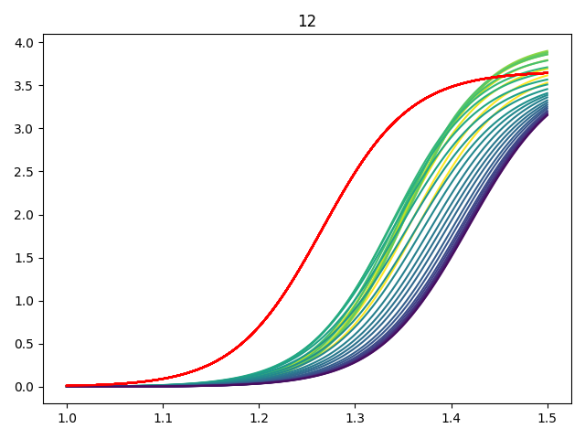

<!---
    Skinstression: skin stretch regression using deep learning
	Copyright (C) 2024  Siem de Jong
    See LICENSE for full license.
-->
# Skinstression

**Skin stretch regression using deep learning** or **Skinstression** is a deep learning framework to predict the stress-strain curve of skin tissue.
A convolutional neural network is trained on second harmonic generation images of skin tissue, matched with stretch measurements as targets.

*Training data is not made publicly available.*

## Quick start
A common CLI workflow includes:
| Task | Terminal |
|------|----------|
| Login to wandb | wandb login |
| Initializing a sweep | *not supported yet* |
| Running a wandb sweep agent | *not supproted yet* |
| Training a model | python train.py |
| Predicting using a model | python predict.py |

For logging to wandb, it is required to login to wandb.

NOTE: please take a look at `train.py` or `predict.py` when training or predicting.
They contain settings you may need to change before launching scripts.
Some settings are consumed by Pytorch Lightning ([docs](https://lightning.ai/docs/pytorch/stable/)).

## Training
Training with `python train.py` will make a `tmp` directory containing the splits.
Subsequent runs will reuse the splits.
Users can modify the splits.
Users can modify training parameters in `train.py`.

## Predicting
Predict with `python predict.py`, will make use of the `tmp` directory containing the splits, or make the splits if they don't exist yet.
Data is read sequentially.
If `save_plots=True`, plots are save to the `tmp` directory.
Lines are color coded by slice index (which is not necessarily depth first, depending on the scanning protocol).

<center></center>

## Data
> stacks.zarr

The `SkinstressionDataset` and `SkinstressionDataModule` rely on the iamges to be written to a zarr store.
Every 3D image should be saved separately in a zarr store.
This allows for easy migration to 3D models, which are currently not implemented, because they require a lot of GPU memory, not always available.
Use `notebooks/13-sj-tozarr.ipynb` as a starting point to achieve conversion to Zarr.

> params.csv

This is the target file.
The first column indicates the sample.
Subsequent columns indicate the target parameters.

> sample_to_person.csv

File mapping samples (`sample_id`) to person identifiers (`person_id`).

> curves/

This directory contains curves with `<sample_id>.csv` and has columns `strain` and `stress`, making up the stress-strain curves.
`params.csv` was calculated using these curves.


## Roadmap
- [ ] predict.py where curves of the (test) dataset are plotted
- [ ] Cross validation using GroupKFold

## Extension possibilities
Any user can contribute their own models and datasets by modifying `skinstression/dataset.py` or `skinstression/model.py`.

## Installation
Do below steps in a python environment.
Skinstression is tested with python 3.11.

Install pytorch for your system.
See [pytorch.org](https://pytorch.org/get-started/locally/).

Clone this repository and install the needed dependencies.
```sh
git clone https://github.com/siemdejong/skinstression
cd skinstression
pip install .
```

If you would like to make changes, install as editable with `pip install -e .`.

## Contributing
Contributions are welcome.

1. Create an issue.
1. Fork this repository.
1. Clone the fork.
1. Make a new branch.
1. Commit changes.
1. Push the new branch to the fork.
1. Make a pull request to this repository.
